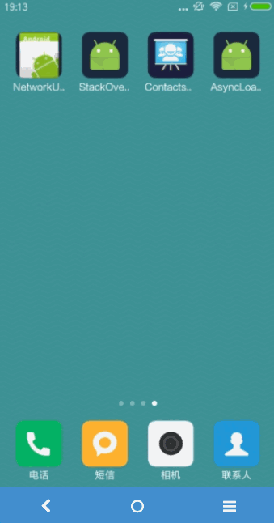
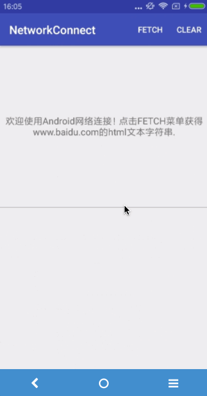
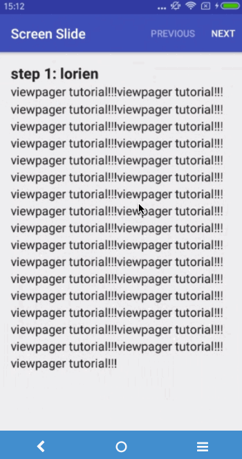
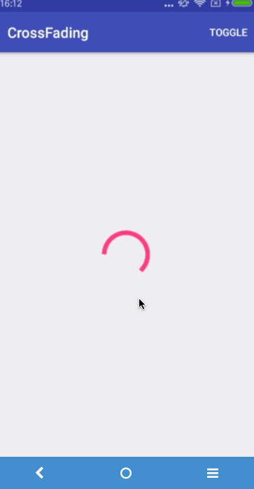
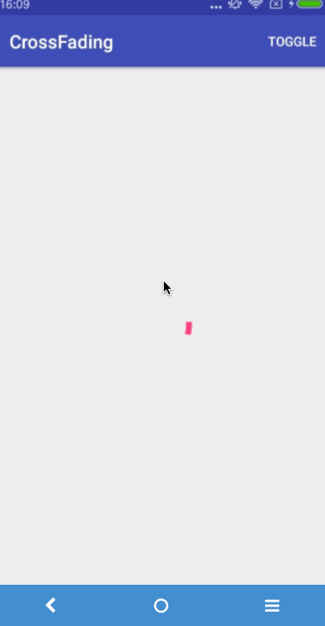
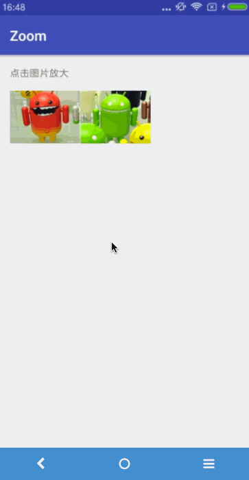
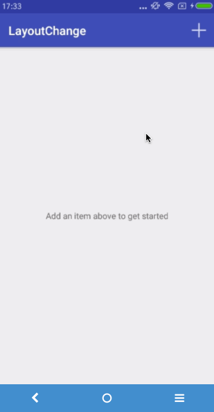

##### Welcome to visit:
Github: https://github.com/lorienzhang

Blog: http://blog.csdn.net/h_zhang

---

# AsyncLoader
关于Android数据异步加载机制以及获取联系人信息的例子

### 效果图
<div class='row'>
	
</div>

### 相关知识点
* Loader机制：LoaderManager, LoaderManager.Callbacks, CursorLoader, CursorAdapter;
* 获取联系人信息，查询Contacts表：DISPLAY_NAME；
* 获取某一联系人详细信息，查询Conatacts.DATA表；
* 从Cursor中取数据用到的index和先前定义PROJECTION是一一对应的；
* 从Cursor中取数据的编码风格一半固定：cursor.moveToFirst(); do{...}while(cursor.moveToNext());

# StackOverflowXmlParser
关于XML的pull解析的一个例子

###XML Feed的URL
http://stackoverflow.com/feeds/tag?tagnames=android&sort=newest

###XML大致内容
```xml
<feed xmlns="http://www.w3.org/2005/Atom" xmlns:creativeCommons="http://backend.userland.com/creativeCommonsRssModule" ...">
     <title type="text">newest questions tagged android - Stack Overflow</title>
     ...
     <entry>
     ...
     </entry>
     <entry>
         <id>http://stackoverflow.com/q/9439999</id>
         <re:rank scheme="http://stackoverflow.com">0</re:rank>
         <title type="text">Where is my data file?</title>
         <category scheme="http://stackoverflow.com/feeds/tag?tagnames=android&sort=newest/tags" term="android"/>
         <category scheme="http://stackoverflow.com/feeds/tag?tagnames=android&sort=newest/tags" term="file"/>
         <author>
         <name>cliff2310</name>
         <uri>http://stackoverflow.com/users/1128925</uri>
         </author>
         <link rel="alternate" href="http://stackoverflow.com/questions/9439999/where-is-my-data-file" />
         <published>2012-02-25T00:30:54Z</published>
         <updated>2012-02-25T00:30:54Z</updated>
         <summary type="html">
         <p>I have an Application that requires a data file...</p>

         </summary>
     </entry>
     <entry>
     ...
     </entry>
    ...
 </feed>
```

代码解析出XML Feed中所有的entry条目，并存于list中；

# NetworkConnet
关于网络连接，以及从网络中获取数据的基本操作

### 效果图
<div class='row'>
	
</div>

### 相关知识点
* 布局中layout_weight属性，实现两个TextView各占据一半空间；
* 使用headless fragment封装网络操作，以及处理网络操作过程中的events;
* 使用HttpUrlConnection从网络中获取数据；
* DownloadCallback接口的设计，可以参考AsyncTask中的回调函数设计接口；
* AsyncTask的基本用法；AsyncTask.execute(), AsyncTask.cancel();
* 注意Activity潜在的内存泄漏，在Fragment的onDetach()回调中解除对Activity的引用：mCallback=null;
* 防止Activity重构导致Fragment引用丢失，setRetainInstance(true);这样如果Activity，仍然可以找到之前的Fragment；

# ScreenSlide
屏幕滑动，ViewPager的基本使用

### 效果图
<div class='row'>
	
</div>

### 相关知识点
* ViewPager + FragmentStatePagerAdapter + Fragment基本使用；
* 带参数的字符串资源的使用：R.string.title

# CrossFade
view切换时添加淡入淡出效果，增强用户体验

### 效果图
下面左图是不使用crosssfade的效果，右图是使用crossfade的效果；
<div class='row'>
	
	
</div>

### 相关知识点
* 在view切换之间加入交叉淡入淡出效果，这样可以增强用户体验；
* crossfade效果利用属性动画实现，掌握属性动画的基本使用，View.anim().play().with()....;

# zoom
关于图片缩放的一个例子！！！

### 效果图
<div class='row'>
	
</div>

### 相关知识点
* View.getGlobalVisibleRect(rect, globalOffset) 获取到view相对于屏幕的坐标，存于rect之中;

* 确定对thumbnail是水平放大，还是垂直放大;

* 使用CenterCrop技术对图片进行裁剪，防止动画过程中产生不必要的拉伸;

* 起始位置和终点位置坐标的计算---Math;

* 属性动画的基本使用;

---

# LayoutChange
为布局改变添加动画效果

### 效果图
<div class='row'>
	
</div>

### 相关知识点
* 整体效果类似ListView，但是使用orientation为Vertical的LinearLayout实现的，如果item不是很多，这种方式比ListView更加轻量级；
* LinearLayout属性：android:animateLayoutChanges="true"，设置这个属性后，如果LinearLayout的布局发生变化，系统会添加动画效果；
* 还有关于LinearLayout其它属性：android:showDividers="middle"表示子view之间添加分割线，android:divider="@android:drawable/divider_horizontal_bright"选择系统提供的分割线
